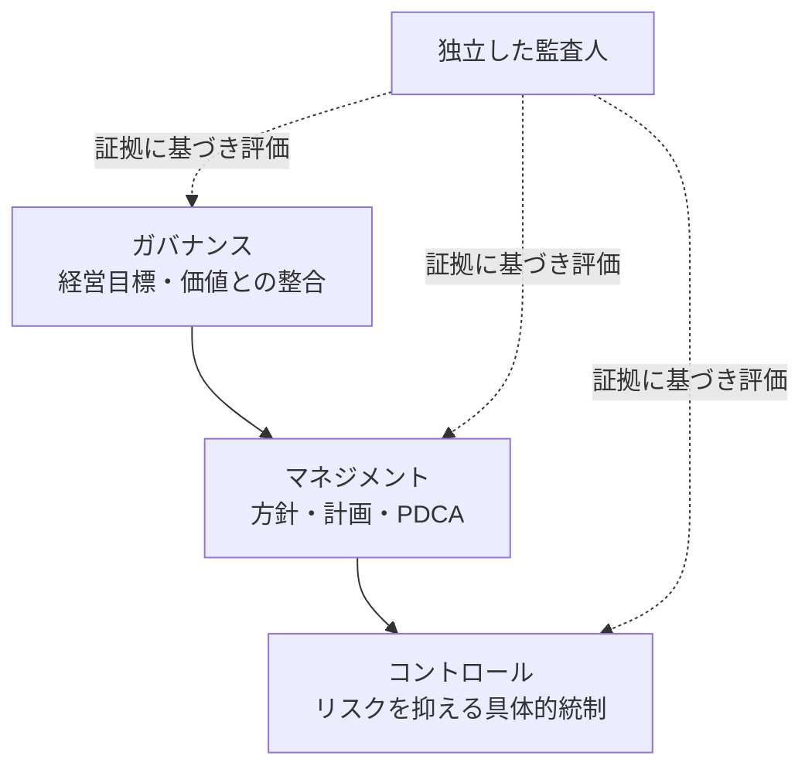
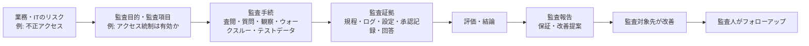

# システム監査

## 2026-08-29

### システム監査基準の用語

- **独立性**とは、監査人が第三者から不当な影響や圧力などを受けていない状態である。監査人が客観的・公正な判断を行うための前提であり、画像の設問の正解は **エ**。
- 独立性には、客観的・公正な判断を行う精神的態度を保つ**精神的独立性**と、監査対象から独立した立場で監査が実施されていると第三者から見える**外観的独立性**がある。
- **所見**とは、監査で発見したこと、又は発見したことに基づく考えや意見である。「標準的な監査人が同じ検証結果を得られる」は再現性の説明であり、所見ではない。
- **正当な懐疑心**とは、何事も当然とせず、誤りや不正の可能性を疑い、批判的に確認・評価する姿勢である。「客観的な立場で公正な判断を行う精神的態度」は精神的独立性の説明である。
- **正当な注意**とは、監査の実施過程で監査人として当然に払うべき専門家としての注意である。

### 見分け方

| 用語 | 要点 |
|---|---|
| 独立性 | 不当な影響・圧力を受けずに監査する |
| 所見 | 監査で発見した事実、又はそれに基づく考え・意見 |
| 正当な懐疑心 | 鵜呑みにせず、不正・誤りの可能性を批判的に確認する |
| 正当な注意 | 監査人として当然に払う専門的な注意 |
| 再現性 | 標準的な監査人でも同じ検証結果を得られること |

### ガバナンス・マネジメント・コントロールの視点

- システム監査では、監査目的に基づき、ガバナンス、マネジメント、コントロールの視点から検証・評価を行う。
- **コントロールの視点**では、業務プロセス等に、リスクに応じた統制が適切に組み込まれ、機能しているかを確認する。異常なアクセスを検出した際に適時に対処・報告されているかは、この視点の項目である。画像の設問の正解は **イ**。
- **マネジメントの視点**では、IT投資管理や情報セキュリティ対策がPDCAサイクルで適切に管理されているかなど、ITシステムの管理プロセスを確認する。
- **ガバナンスの視点**では、IT投資が適切なリターンを生んでいるか、新技術や技術革新を経営戦略の推進に活用できているかなど、経営目標との整合や価値創出を確認する。

### 見分け方

| 視点 | 主に確認すること | 設問の例 |
|---|---|---|
| ガバナンス | 経営戦略との整合、IT投資の価値・成果 | IT投資のリターン、新技術の戦略活用 |
| マネジメント | ITシステムを管理する仕組み・PDCA | セキュリティ対策のPDCA管理 |
| コントロール | リスクに応じた統制の実装・運用 | 異常アクセス検出後の対処・報告 |

### 参考

- [経済産業省：システム監査基準（令和5年）基準4](https://www.meti.go.jp/policy/netsecurity/sys-kansa/sys-kansa-2023r.pdf)
- [経済産業省：システム監査基準（令和5年）コントロールの視点](https://www.meti.go.jp/policy/netsecurity/sys-kansa/sys-kansa-2023r.pdf)
- [IPA：令和7年度秋期 応用情報技術者試験 午前問題](https://www.ipa.go.jp/shiken/mondai-kaiotu/nl10bi0000009lh8-att/2025r07a_ap_am_qs.pdf)

## 2026-09-06

### ウォークスルー法と監査手法の区別

- **ウォークスルー法**は、特定のデータ又は取引を、生成から入力・処理・出力・利用まで実際に追跡し、その各段階に組み込まれた一連のコントロールを確認する監査手法である。処理の流れと統制が、設計・運用どおりにつながっているかを確かめる。
- 「データの生成から入力、処理、出力、利用までのプロセス及び組み込まれた一連のコントロールを確認する」はウォークスルー法の説明であり、画像の設問の正解は **ウ**。

| 手法 | 内容 | 設問の選択肢 |
| --- | --- | --- |
| 文書閲覧・記録の査閲 | 規程、台帳、ログ、証憑などの資料を入手して内容を検討する | ア |
| 質問（インタビュー） | 関係者へ口頭で質問し、回答を得る | イ |
| ウォークスルー法 | 一つのデータ・取引を開始から利用まで追跡し、処理と統制のつながりを確認する | ウ |
| テストデータ法 | 監査人が用意したテストデータを対象プログラムで処理し、期待した結果になるかを確かめる | エ |

#### Related To

- A1-0211（ウォークスルー法）
- A1-0212（システム監査の代表的な確認手法）

### 監査手続と監査証拠

- **監査手続**は、監査項目について結論を導けるよう、**十分かつ適切な監査証拠を入手するために実施する具体的な手続**である。質問、文書の査閲、観察、ウォークスルー、テストデータ法などは監査手続として用いられる。
- より直感的には、**監査手続 = 実際に監査人が行うアクション**と考えると分かりやすい。例えば、**書類を読む、担当者に質問する、1件のデータを最初から最後まで追う、テストデータを流す**といった行動である。
- つまり、監査手続は「何を確認するか」という監査項目そのものではなく、**監査証拠を集めるために、どう確認するかという具体的な行動**を指す。覚え方は **「監査手続 = 証拠を取るための具体的な行動」**。
- 「監査項目について、十分かつ適切な証拠を入手するための手続」が監査手続の説明であり、画像の設問の正解は **ウ**。

| 選択肢の内容 | 区別 |
| --- | --- |
| 監査計画の立案、監査業務の進捗管理 | 監査の計画・管理に関する活動であり、個別の証拠収集手続そのものではない。 |
| 監査結果を受け、監査報告書へ監査人の結論や指摘事項を記述 | 監査報告に関する手続である。 |
| 十分かつ適切な証拠を入手 | 監査手続である。 |
| 監査テーマに合わせた監査チームの構成 | 監査体制の整備に関する活動である。 |

#### Related To

- A1-0211（ウォークスルー法）
- A1-0212（システム監査の代表的な確認手法）
- A1-0213（監査手続と監査証拠）

<!-- past-exam-sync: 過去問/令和6年度秋季解説.md#午前I-問22:start -->
## 2026-09-07

### システム監査におけるフォローアップ

- **フォローアップ**は、監査報告書を提出して終わりにせず、監査で示した改善提案がその後どう実施されているかを確認し、改善状況を継続的に把握する活動である。
- 令和6年度秋期 高度試験 午前I 問22では、**システム監査人が、監査報告書に記載した改善提案の実施状況に関する情報を収集し、改善状況をモニタリングする**という **ウ** がフォローアップの説明であり、正解である。
- 覚え方は、**監査 → 報告 → 改善 → フォローアップで改善状況を確認**。フォローアップは「追加監査を最初からやり直すこと」ではなく、監査後の改善が進んでいるかを見る段階である。

| 選択肢 | 主体・内容 | 判断 |
| --- | --- | --- |
| ア | 監査対象先が、指摘事項・改善提案を基に改善計画を策定する | 改善する側の活動。監査人によるフォローアップそのものではない |
| イ | 監査部門の責任者が、監査の実施状況や指摘事項の妥当性を確認する | 監査業務の品質管理・監督に近く、改善状況を追うフォローアップではない |
| **ウ** | **システム監査人が改善提案の実施状況を収集し、改善状況をモニタリングする** | **フォローアップそのもの** |
| エ | 時間の関係で調査できなかった監査項目を追跡調査して報告する | 未完了だった監査手続の追加実施であり、改善状況確認とは別 |

#### 主体を見れば解きやすい

- **監査対象先**：改善計画を作成し、改善を実施する側。
- **システム監査人**：改善提案の実施状況を確認・モニタリングする側。
- **監査部門の責任者**：監査業務そのものの適切性や品質を管理・監督する側。

#### Related To

- A1-0060（システム監査の独立性）
- A1-0213（監査手続と監査証拠）
- A1-0275（フォローアップの意味）
- A1-0276（フォローアップにおける主体の区別）

#### 参考

- [経済産業省：システム監査基準（令和5年）](https://www.meti.go.jp/policy/netsecurity/sys-kansa/sys-kansa-2023r.pdf)
- [IPA：令和6年度秋期 高度試験 午前Ⅰ 問題](https://www.ipa.go.jp/shiken/mondai-kaiotu/m42obm000000afqx-att/2024r06a_koudo_am1_qs.pdf)
- [IPA：令和6年度秋期 高度試験 午前Ⅰ 解答例](https://www.ipa.go.jp/shiken/mondai-kaiotu/m42obm000000afqx-att/2024r06a_koudo_am1_ans.pdf)
<!-- past-exam-sync: 過去問/令和6年度秋季解説.md#午前I-問22:end -->

<!-- past-exam-sync: 過去問/令和6年度秋季解説.md#午前I-問21:start -->
## 2026-09-07

### ウォークスルー法と監査技法の区別

- **ウォークスルー法**は、一つのデータや取引を、**生成 → 入力 → 処理 → 出力 → 利用**まで実際に追跡し、その途中に組み込まれているコントロールがどう働くかを確認する監査技法である。
- 令和6年度秋期 高度試験 午前I 問21では、「データの生成から入力、処理、出力、活用までのプロセスと、組み込まれているコントロールを、書面上又は実際に追跡する」とあるので、正解は **ア：ウォークスルー法**。

```text
取引・データ発生
      ↓
    入力
      ↓
    処理
      ↓
    出力
      ↓
    利用

この一本の流れを追いながら、各地点の統制を確認する
```

| 選択肢 | 主な意味 | 問21での判断 |
| --- | --- | --- |
| **ア ウォークスルー法** | データ・取引を最初から最後まで追跡して処理と統制を確認 | **正解** |
| イ チェックリスト法 | あらかじめ用意した確認項目に沿って漏れなく点検 | 一つの取引を流れに沿って追う技法ではない |
| ウ 突合・照合法 | 二つ以上の資料・記録・データを照合して一致や整合性を確認 | 処理プロセス全体の追跡とは異なる |
| エ ドキュメントレビュー法 | 規程、設計書、記録などの文書を査閲して内容を確認 | 実際の処理の流れを追跡すること自体が中心ではない |

#### 見分け方

- **一件を入口から出口まで追う** → ウォークスルー
- **決められた項目を順に確認する** → チェックリスト
- **二つの資料を突き合わせる** → 突合・照合
- **文書そのものを読む** → ドキュメントレビュー

#### Related To

- A1-0211（ウォークスルー法）
- A1-0212（代表的な監査手法の区別）
- A1-0366（対比：チェックリスト法・突合／照合法・ドキュメントレビュー法）

#### 参考

- [IPA：令和6年度秋期 高度試験 午前Ⅰ 問題](https://www.ipa.go.jp/shiken/mondai-kaiotu/m42obm000000afqx-att/2024r06a_koudo_am1_qs.pdf)
- [IPA：令和6年度秋期 高度試験 午前Ⅰ 解答例](https://www.ipa.go.jp/shiken/mondai-kaiotu/m42obm000000afqx-att/2024r06a_koudo_am1_ans.pdf)
<!-- past-exam-sync: 過去問/令和6年度秋季解説.md#午前I-問21:end -->

## 2026-09-08

### システム監査の全体像

- **システム監査**は、専門性と客観性を備えた監査人が、一定の基準に基づいてITシステムの利活用を検証・評価し、ガバナンス、マネジメント、コントロールの適切性に関する**保証**を与え、又は改善のための**助言**を行う活動である。
- 監査の目的は、ITシステムに関わるリスクへの対応を評価し、組織目標の達成と利害関係者への説明責任を支援することである。監査人自身がシステムを運用・改善することではない。



| 層 | 誰が担うか | 問い |
| --- | --- | --- |
| ガバナンス | 経営層・取締役会等 | ITは経営目標・価値創出に整合しているか |
| マネジメント | IT部門・業務管理者等 | 方針・計画・PDCAにより適切に管理しているか |
| コントロール | 業務・システムの運用者等 | リスクを抑える統制が設計され、実際に機能しているか |
| システム監査 | 独立した監査人 | 三層の適切性を証拠に基づき検証・評価し、保証又は助言を行う |

- 監査は、**監査計画 → 監査手続による証拠収集 → 評価・結論 → 監査報告 → 監査対象先による改善 → 監査人のフォローアップ**と進む。監査対象先が改善を実施し、監査人はその実施状況を確認するため、両者の役割を混同しない。
- 設問では、次の順で読むと判定しやすい。

  1. 役割を問うなら、経営・管理者・運用者・監査人のどの主体かを見る。
  2. 対象を問うなら、戦略・価値はガバナンス、管理の仕組みはマネジメント、具体的な統制の作動はコントロールと分ける。
  3. 監査人の行為なら、証拠収集は監査手続、結論の伝達は報告、改善状況の確認はフォローアップと分ける。

#### 監査人が具体的に行うこと



| 用語 | 具体例 | 何を表すか |
| --- | --- | --- |
| 監査項目 | 「特権IDの付与は承認されているか」 | **何を確認するか** |
| 監査手続 | 承認記録・アクセスログを査閲し、担当者へ質問する | **どう確認するか** |
| 監査証拠 | 承認記録、アクセスログ、設定値、質問への回答 | **結論の根拠** |
| 監査所見・結論 | 承認されていない特権IDがあり、統制が不十分 | **証拠を評価した結果** |
| 改善提案 | 承認フローと定期棚卸しを整備する | **リスク低減の助言** |

- 監査計画では、全てを同じ深さで調べるのではなく、業務への影響や発生可能性が大きいリスクを優先して監査対象・監査項目・手続を決める。この考え方を**リスク・アプローチ**という。
- 例えば「異常アクセスを検出して報告する仕組みがあるか」はコントロールの確認であり、ログを査閲して実際に機能したかを確かめるのが監査手続である。仕組みを自ら運用することは監査人の役割ではない。

#### Related To

- A1-0060（システム監査の独立性）
- A1-0063（コントロールの視点と異常アクセスへの対処）
- A1-0064（ガバナンス・マネジメント・コントロールの違い）
- A1-0211（ウォークスルー法）
- A1-0213（監査手続と監査証拠）
- A1-0275（フォローアップの意味）
- A1-0296（システム監査の目的・役割・流れ）

<!-- past-exam-sync: 過去問/令和6年度春季解説.md#午前I-問21:start -->
## 2026-09-10

### システム監査の対象となる三つの観点

- 令和6年度春期 高度試験 午前I 問21の正解は **ア：ガバナンス**。
- システム監査基準（令和5年）では、監査人が一定の基準に基づいて総合的に点検・評価する対象を、情報システムの**ガバナンス、マネジメント、コントロール**としている。
- ガバナンスは経営目標との整合や価値創出、マネジメントは方針・計画・PDCAなどの管理、コントロールはリスクに対応する具体的な統制の実装・運用という視点で区別する。

#### 選択肢の判断

| 選択肢 | 判断 |
| --- | --- |
| **ア ガバナンス** | **正しい。マネジメント、コントロールと並ぶ監査対象の観点** |
| イ コンプライアンス | 誤り。法令・規範の遵守は重要な評価事項になり得るが、設問で問う三つの観点の名称ではない |
| ウ サイバーレジリエンス | 誤り。サイバー攻撃を受けても事業・機能を維持、復旧する能力を指し、三つの観点の名称ではない |
| エ モニタリング | 誤り。統制や改善状況を監視する活動であり、ガバナンス・マネジメント・コントロールと並ぶ監査対象の名称ではない |

- 覚え方は、**システム監査の三観点＝GMC（Governance・Management・Control）**。

#### Related To

- A1-0064（ガバナンス・マネジメント・コントロールの違い）
- A1-0296（システム監査の全体像）

#### 参考

- [IPA：令和6年度春期 高度試験 午前Ⅰ 問題](https://www.ipa.go.jp/shiken/mondai-kaiotu/m42obm000000afqx-att/2024r06h_koudo_am1_qs.pdf)
- [IPA：令和6年度春期 高度試験 午前Ⅰ 解答例](https://www.ipa.go.jp/shiken/mondai-kaiotu/m42obm000000afqx-att/2024r06h_koudo_am1_ans.pdf)
<!-- past-exam-sync: 過去問/令和6年度春季解説.md#午前I-問21:end -->

<!-- past-exam-sync: 過去問/令和6年度春季解説.md#午前I-問22:start -->
## 2026-09-10

### ITに係る全般統制と業務処理統制

- 令和6年度春期 高度試験 午前I 問22の正解は **ウ：販売管理システムにおける入力データの正当性チェック機能**。
- **ITに係る全般統制**は、複数のシステムや業務処理統制が適切に機能するための共通基盤を整える統制である。アクセス管理、システム開発・変更管理、外部委託管理、運用管理などが該当する。
- **ITに係る業務処理統制（アプリケーション統制）**は、個別の業務システムに組み込まれ、取引データの入力・処理・出力について、正確性、完全性、正当性などを確保する統制である。入力値の形式・範囲・重複などのチェックが代表例である。

#### 選択肢の判断

| 選択肢 | 判断 |
| --- | --- |
| ア サーバ室への入退室を制限・記録する入退室管理システム | 誤り。システム基盤を物理的に保護する共通的なアクセス管理であり、全般統制に当たる |
| イ システム開発業務を適切に委託するための選定手続 | 誤り。開発・外部委託を組織横断的に管理する手続であり、全般統制に当たる |
| **ウ 販売管理システムにおける入力データの正当性チェック機能** | **正しい。個別の業務処理へ組み込まれた入力統制であり、業務処理統制に当たる** |
| エ 不正アクセスを防止するためのファイアウォールの運用管理 | 誤り。IT基盤全体のアクセス・運用管理であり、全般統制に当たる |

- 覚え方は、**全般統制＝IT基盤・組織全体の土台、業務処理統制＝個別アプリの入力・処理・出力チェック**。

#### Related To

- A1-0064（コントロールの視点）
- A1-0334（IT全般統制と業務処理統制の違い）

#### 参考

- [IPA：令和6年度春期 高度試験 午前Ⅰ 問題](https://www.ipa.go.jp/shiken/mondai-kaiotu/m42obm000000afqx-att/2024r06h_koudo_am1_qs.pdf)
- [IPA：令和6年度春期 高度試験 午前Ⅰ 解答例](https://www.ipa.go.jp/shiken/mondai-kaiotu/m42obm000000afqx-att/2024r06h_koudo_am1_ans.pdf)
<!-- past-exam-sync: 過去問/令和6年度春季解説.md#午前I-問22:end -->
